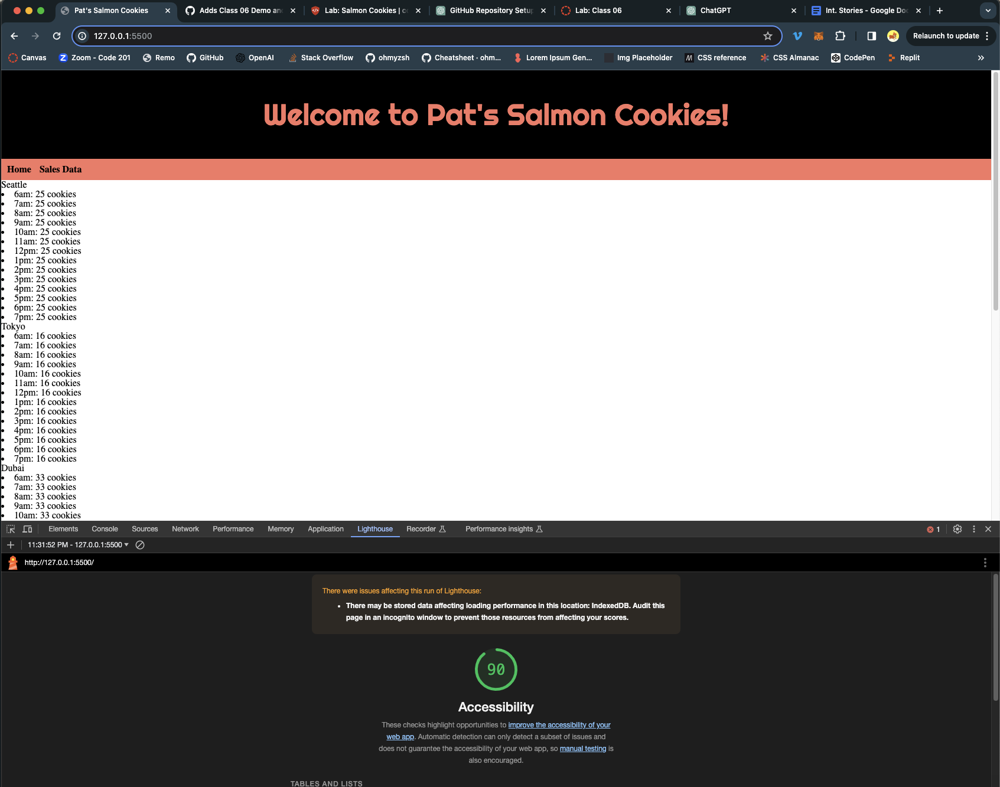

# cookie-stand

LAB - 6
Project Salmon Cookies
I build an app with a direct and powerful purpose. It does all of the things that it accomplishes well. I should describe the purpose and functionality so those that visit my README understand the app

Author: Anthony Blanton
Links and Resources
submission PR
Any Links you used as reference
Lighthouse Accessibility Report Score 90
Provide a screenshot of your score after running a Lighthouse Accessibility report.

Reflections and Comments
Struggled to get a different number for each li item. Will seek assistance and continue to work on this.
