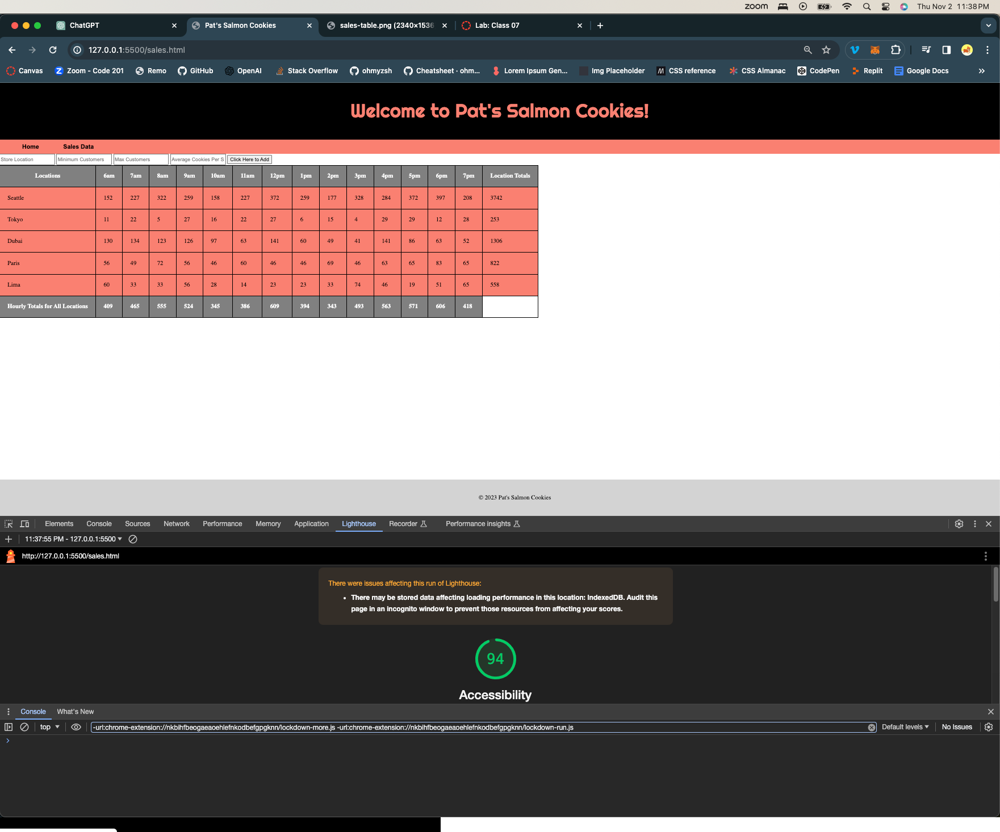

# cookie-stand

LAB - 10b
Project Salmon Cookies
Author: Anthony Blanton

## Lighthouse Accessibility Report Score

- Home (index.html) = 80

- Sales (sales.html) = 94

## Today I:
- completed js for table.
- completed js for the input feature at top
- did some css work to make things look a little better

## Reflections and Comments
- Lab 9 was tricky, not unlike all the labs this week. I still need time to finish up a few things on each lab, so looking forward to the weekend to continue working.
